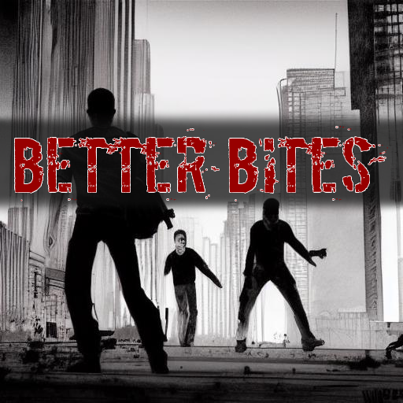
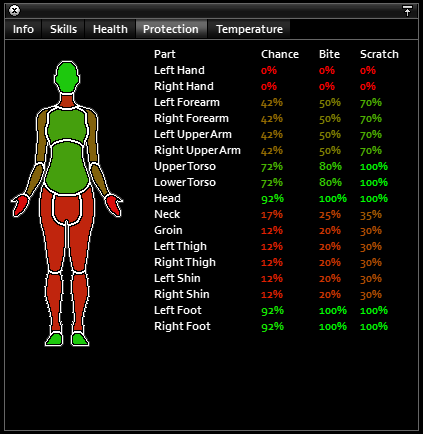
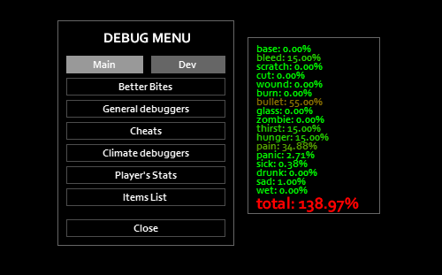

# Better Bites

Every time a zombie lands a hit on you, the game decides whether it is a scratch, laceration or bite.

This mod overrules the game in how this decision is made.

## Summary

PZ's default bite mechanics essentially boil down to:
- Have bite-protecting clothing
- Don't get attacked from behind

It's.. fine. Really! But there's not a lot of dimension for generating drama, imho.

With this mod, if you're healthy and in good spirits, the chance of getting bit is practically zero. Go raid!

However, as your injuries and negative moodles stack up, so does your bite chance.

If you get bitten with this mod, you only have yourself to blame.

## Bite Chance

Better Bites calculates its own bite chance using a number of factors:

- Base bite chance (default: 1%)
- Increased chance per scratch, laceration, deep wound, burn, etc
- Increased chance based on thirst, hunger, sadness, etc

### Injury Selection

Once the game decides you've been hit, Better Bites will roll against your current bite chance.

If Better Bites decides you got bit, you will. If it decides you didn't, you wont.

**Deep Wounds**:

If the game would apply a bite, but Better Bites disagrees, it will downgrade the injury to an infected deep-wound. Life-threatening, but not fatal.

## Protection HUD

  

The "Protection" tab in the status window has been updated with a "Chance" column. This shows how likely you are to dodge a bite. The values in this column will continuously change as your overall health changes.

## Debug Window

  

By running the game with the `-debug` flag, you can view the internal contributions to bite chance by all your current conditions. Just click the "Better Bites" button in the Debug Menu.

## Configuration

The contributions to bite chance for each condition can be configured in the game's options menu before starting a new game.

### Default Values

- **Base Bite Chance**: 1%
- **Bleeding**: 15%
- **Scratched**: 2.5%
- **Lacerated**: 8%
- **Deep Wound**: 20%
- **Burned**: 45%
- **Bullet Wound**: 55%
- **Glass Wound**: 33%
- **Zombie**: 1%
- **Thirst**: 15%
- **Hunger**: 15%
- **Pain**: 75%
- **Panic**: 45%
- **Sick**: 50%
- **Drunk**: 33%
- **Sad**: 15%
- **Wet**: 25%